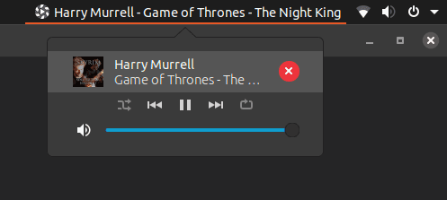
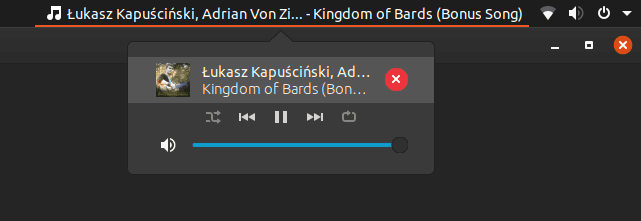
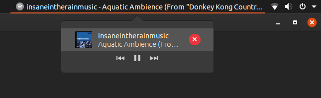
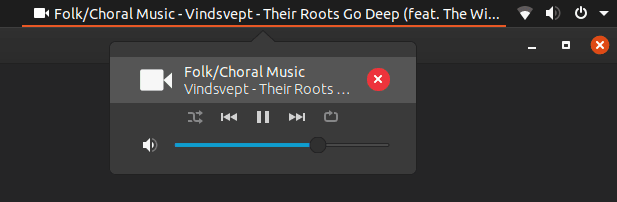

# gnome-shell-extension-mpris-indicator
[](https://www.gnu.org/licenses/gpl-3.0)

 A full featured MPRIS indicator extension for GNOME Shell 3.34+

<br/>

|  | 
|:--:| 
| *Neither the artist text nor the title text has been truncated.* |

<br/>

|  | 
|:--:| 
| *Only the artist text has been truncated.* |

<br/>

|  | 
|:--:| 
| *Only the title text has been truncated.* |

<br/>

|  | 
|:--:| 
| *Only the title is displayed for audio that lists itself as the artist (YouTube, Spotify, etc).* |

<br/>

## Installation
1. Clone or download this repository
  * `git clone https://github.com/tvenissat/gnome-shell-extension-mpris-indicator.git`
2. Enter the repository's directory
  * `cd gnome-shell-extension-mpris-indicator`
3. Move the extension
  * `cp -r mprisindicator@tvenissat.github.io ~/.local/share/gnome-shell/extensions`
4. Restart your shell
  * press `Alt+f2`, enter `r`, press `enter`
5. Enable the extension
  * run the gnome-tweaks tool (install using `sudo apt
   install gnome-tweaks` if you have not already), select the `Extensions` tab, 
   check the `Mpris indicator` switch

## Customizing
After installing the extension, you can customize the indicator by changing the
following variables located in the `updateIndicator`
function inside of the
`~/.local/share/gnome-shell/extensions/mprisindicator@tvenissat.github.io/widgets.js`
file as seen
[here]().

``` javascript
// This is the string used to separate the artist and title text.
let delimiter = ' - ';

// This is the string appended to the end of the artist and title text when they are truncated.
let suffix = '...';

// This is the maximum length of the artist/title text.
// Increase/decrease this if you want the indicator text to display more/less characters.
let maxSubstringLength = 31;
```

Remember to restart your shell to see your changes!

